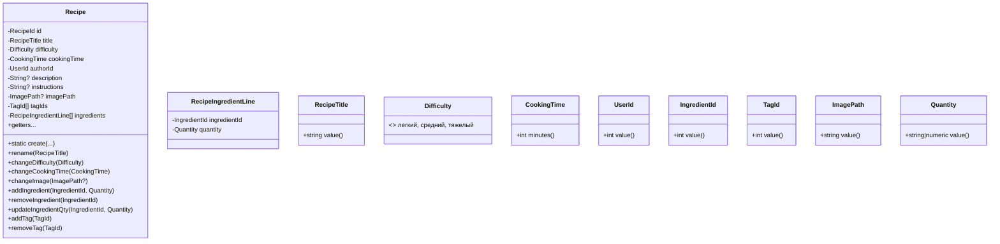
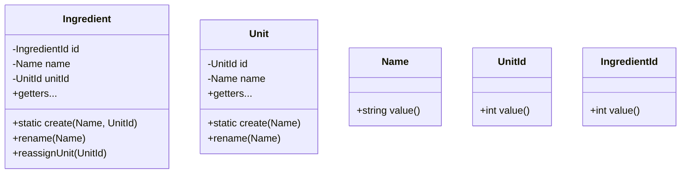
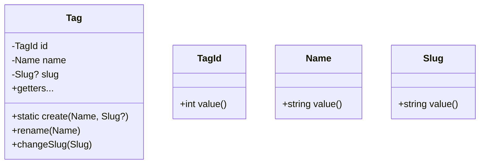
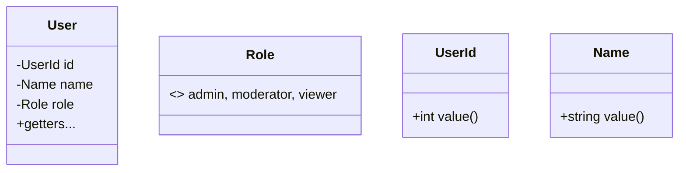

# CookingBook — DDD дизайн и агрегаты

## Поддомены (Bounded Contexts)
- **Рецепты (Core)**
  
  Создание/редактирование рецептов, состав (ингредиенты+количество), сложность, время готовки, фото, автор.
- **Ингредиенты и единицы измерения (Supporting)**
  
  Справочник ингредиентов и их базовая единица измерения.
- **Теги/Таксономия (Supporting)**
  
  Справочник тегов и привязка тегов к рецепту.
- **Пользователи и роли (External/Upstream)**
  
  Идентификация автора, роли admin/moderator/viewer. В домене рецептов используем только UserId.
- **Медиа (Supporting)**
  
  Хранение путей к изображениям, без отдельной доменной модели (пока Value Object).
- **Интеграции и уведомления (Supporting)**
  
  Доменные события (RecipeCreated/RecipeUpdated) → публикация в очередь.
- **Поиск/Фильтрация и отчёты (Reporting/Read Model)**
  
  Кэшированные выборки и метрики (админ-панель). Это чтение/проекции, не агрегаты.

## Агрегаты, инварианты и команды

### Рецепты — Aggregate Root: `Recipe`
- Value Objects: `RecipeId`, `RecipeTitle`, `Difficulty`, `CookingTime`, `UserId`, `ImagePath`, `TagId[]`, `RecipeIngredientLine[]`.
- Внутренняя сущность: `RecipeIngredientLine { IngredientId, Quantity }`.
- Инварианты:
  - `RecipeTitle`: 3–200 символов, не пустой.
  - `Difficulty`  {легкий, средний, тяжелый}.
  - `CookingTime` > 0 минут.
  - Нет дубликатов `IngredientId` в составе.
- Команды (без сеттеров):
  - `create`, `rename`, `changeDifficulty`, `changeCookingTime`, `changeImage`.
  - `addIngredient(IngredientId, Quantity)`, `removeIngredient(IngredientId)`, `updateIngredientQty(IngredientId, Quantity)`.
  - `addTag(TagId)`, `removeTag(TagId)`.

#### Диаграмма (Mermaid)

### Ингредиенты — Aggregate Root: `Ingredient`
- VO: `IngredientId`, `Name`, `UnitId`.
- Инварианты: `Name` не пустой; `UnitId` обязателен; уникальность `Name` на уровне домена/репозитория.
- Команды: `create(Name, UnitId)`, `rename(Name)`, `reassignUnit(UnitId)`.

#### Диаграмма (Mermaid)

### Единицы измерения — Aggregate Root: `Unit`
- VO: `UnitId`, `Name`.
- Инварианты: `Name` не пустой; уникальность `Name`.
- Команды: `create(Name)`, `rename(Name)`.

### Теги — Aggregate Root: `Tag`
- VO: `TagId`, `Name`, `Slug`?
- Инварианты: `Name` не пустой; `Slug` уникален (если используется).
- Команды: `create(Name, Slug?)`, `rename(Name)`, `changeSlug(Slug)`.

#### Диаграмма (Mermaid)

### Пользователи (внешний контекст) — Aggregate Root: `User`
- VO: `UserId`, `Role`.
- В домене рецептов используем только `UserId`; объектные ссылки на `User` внутри агрегатов отсутствуют.

#### Диаграмма (Mermaid)
